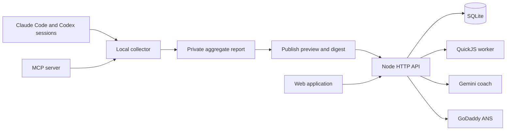

# VibeScore implementation

This document describes the current VTHacks 14 build.

## Architecture



## Repository map

| Path | Purpose |
| --- | --- |
| `collector/src` | Claude Code and Codex parsers, feature extraction, reports, CLI, and MCP server |
| `backend/src` | HTTP API, accounts, persistence, scoring, challenges, AI providers, ANS, and sandbox runner |
| `backend/public` | Production HTML, CSS, and compiled browser bundle |
| `web/src` | Browser application source |
| `backend/test` | Account, API, assessment, runner, persistence, and integration tests |
| `collector/test` | Parser, privacy, identity, report, and MCP tests |
| `harness` | Deterministic synthetic sessions used to verify score separation |
| `scripts` | Production browser build |

## Evidence model

VibeScore keeps two score types separate:

- **Workflow score:** derived from selected real-world coding-agent sessions. It measures signals such as framing, correction loops, verification, tool use, and shipping evidence. It is labeled provisional.
- **Challenge rating:** derived from first rated attempts in controlled interview tasks. Correctness comes from trusted server-side tests. Practice drills never change the verified rating.

Public APIs expose challenge prompts, requirements, starter code, and safe examples. They omit hidden tests, judge cases, reference answers, and private rubrics.

## MCP boundary

The stdio MCP server accepts explicit project roots and session files. It does not scan every local project automatically. Its publishing flow is:

1. Analyze the selected files locally.
2. Explain the aggregate and recommend drills.
3. Produce the exact publish payload and SHA-256 digest.
4. Require the caller to provide that digest with confirmation.
5. Send the validated aggregate to the configured HTTPS server.

## Code execution boundary

Interview submissions run inside QuickJS in a worker with time and memory limits. The execution context does not provide Node.js APIs, network access, filesystem access, process state, or environment variables. Visible tests are returned during practice; hidden values remain private during final grading.

## Main API surface

| Route | Purpose |
| --- | --- |
| `GET /api/status` | Service and AI-provider status |
| `POST /api/register`, `/api/login`, `/api/recover`, `/api/logout` | Account lifecycle |
| `GET/PATCH/DELETE /api/me` | Dashboard, visibility, and deletion |
| `GET /api/challenges` | Redacted drill and interview catalog |
| `POST /api/challenges/:id/start` | Start practice or rated attempt |
| `GET/PATCH /api/attempts/:id` | Load and save a draft |
| `POST /api/attempts/:id/run` | Run visible tests |
| `POST /api/attempts/:id/submit` | Grade a completed attempt |
| `POST /api/attempts/:id/chat` | Ask the configured interview coach |
| `POST /api/bundles` | Submit validated workflow aggregates |
| `GET /api/leaderboard` | Challenge or workflow leaderboard |
| `GET /api/profile/:handle` | Opt-in public profile |
| `GET /api/ans/search` | Search registered ANS agents |
| `GET /api/ans/agents/:id` | Read sanitized ANS trust details |

## Storage

SQLite stores users, hashed credentials, immutable workflow bundles, score history, attempts, assistant messages, AI usage, and feedback. Foreign keys are enabled and account deletion cascades through user-owned records. Production uses one application instance with persistent storage at `/home/data`.

## Deployment

The public beta runs on Azure App Service for Linux with Node.js 22, HTTPS-only access, TLS 1.2 or newer, and disabled FTP. The checked-in `.azure/config` identifies the hackathon resource group, plan, region, and app name.

Required production settings:

```dotenv
PUBLIC_ORIGIN=https://your-domain.example
VIBESCORE_DATA_DIR=/home/data
TRUST_PROXY=1
```

Optional integrations use `AI_*` and `ANS_*` settings from [.env.example](.env.example).

## Verification

Run:

```powershell
npm run build
npm test
```

The deployment smoke test should confirm:

1. `/api/status` returns HTTP 200 over HTTPS.
2. A temporary account can register, sign in, and delete itself.
3. Registration responses do not expose session tokens.
4. The public challenge catalog contains no hidden tests or reference solutions.
5. The Hokie readiness route and current browser bundle load without console errors.
6. Gemini and ANS report enabled only after their server-side credentials are configured.
