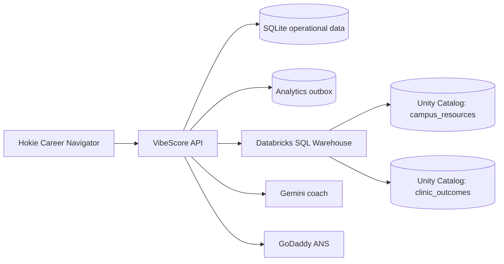

# VibeScore product requirements

**Status:** Public beta and VTHacks 14 build

**Live product:** [vibescore-vthacks-2026.azurewebsites.net](https://vibescore-vthacks-2026.azurewebsites.net)

**Primary audience:** Students and early-career developers who want to improve and prove how well they build with AI

**Hackathon categories:** Overall, Best UI/UX, Best Ut Prosim, Best Use of Gemini API, Best Domain Name from GoDaddy Registry, Deloitte x Databricks AI Agent for the Virginia Tech Student Experience, and GoDaddy Best Use of ANS

## 1. Product summary

VibeScore is the skill and credibility layer for AI-assisted software development. It measures how a developer uses AI on real projects, converts weak areas into targeted drills, runs controlled AI-assisted coding interviews, and allows the developer to publish an evidence-based skill profile and leaderboard score.

The product keeps two kinds of evidence separate:

- **Workflow evidence** comes from explicitly selected Claude Code and Codex sessions. It measures process signals and remains provisional.
- **Challenge evidence** comes from controlled, timed tasks with server-side grading. It produces the assessed public rating.

For VTHacks, the remaining sponsor work forms one connected experience: a **Hokie AI Career Navigator and community skill clinic**. A student completes a private readiness check, receives drills and campus-career recommendations, learns how to inspect AI-agent identity through GoDaddy ANS, and contributes only consented, pseudonymous outcomes to a Databricks impact view. That same flow supports Deloitte x Databricks, Best Ut Prosim, and Best Use of ANS without creating three unrelated demos.

## 2. Problem

AI coding tools can generate output quickly, but current portfolios and interview platforms rarely show whether someone can:

- frame a useful task;
- provide the right context;
- identify and correct failures;
- verify generated work;
- review tradeoffs and security implications;
- use agents efficiently without losing ownership of the result.

Students also lack a clear bridge from “I use AI” to credible evidence that employers, mentors, and peers can inspect. Existing coding leaderboards mostly measure algorithm recall, while raw AI usage counts reward volume instead of judgment.

## 3. Product goals

1. Give users a useful assessment within two minutes and a meaningful practice task within ten minutes.
2. Measure AI-building behavior without uploading raw prompts, source code, local paths, or filenames.
3. Keep controlled challenge ratings distinct from imported real-work signals.
4. Make every public result opt-in and explain what evidence produced it.
5. Give students a practical career-development path: assess, practise, verify, and publish.
6. Demonstrate a useful, coherent application of Gemini, Databricks, and GoDaddy ANS.
7. Serve the Virginia Tech community through a free, accessible AI-readiness clinic with measurable outcomes.

## 4. Non-goals for the hackathon release

- Claiming that a workflow score proves job performance.
- Ranking users from practice attempts or raw prompt volume.
- Uploading complete conversations or repositories for analytics.
- Treating an ANS trust score as a guarantee of agent quality, safety, or endorsement.
- Invoking arbitrary endpoints returned by the ANS registry.
- Making the user-facing application depend on Databricks availability for core scoring or practice.
- Claiming community impact before a real pilot has occurred.

## 5. Users and core journeys

### Student builder

1. Opens the readiness check without creating an account.
2. Receives a skill diagnosis and one recommended drill.
3. Creates a private account if they want to save progress.
4. Completes drills and a timed interview with Gemini coaching.
5. Runs objective tests and receives a controlled challenge result.
6. Chooses whether to publish a profile and appear on a leaderboard.

### Project builder

1. Runs the local VibeScore MCP against a project and session files they explicitly select.
2. Reviews an aggregate workflow report and recommended drills.
3. Previews the exact publish payload and digest.
4. Confirms publication in a separate step.
5. Keeps the workflow score visibly labeled as provisional.

### Career clinic participant

1. Joins a free workshop or opens the no-account Hokie path.
2. Completes a readiness check and targeted practice.
3. Learns to inspect a registered AI agent's identity, lifecycle, capabilities, trust coverage, and missing signals.
4. Optionally consents to anonymous program-outcome measurement.
5. Receives campus and career recommendations from the navigator.

### Program organizer

1. Views aggregate clinic participation and completion.
2. Compares baseline and follow-up skill bands.
3. Sees sample size, response rate, data freshness, and limitations.
4. Uses the largest aggregate skill gaps to choose the next workshop or drill.

## 6. Current implementation

### Completed product capabilities

| Area | Delivered behavior | Evidence in repository |
| --- | --- | --- |
| Public application | Responsive single-page product with landing, practice, privacy, leaderboard, profiles, and settings | `web/src/app.js`, `backend/public` |
| Accounts | Registration, secure sessions, login, recovery code, visibility controls, and cascading deletion | `backend/src/store.ts`, `backend/src/server.ts` |
| Curriculum | Thirteen drills across framing, context, debugging, verification, review, architecture, and efficiency | `backend/src/challenges.ts` |
| Interviews | Six timed JavaScript interview rounds with workspace artifacts, visible and hidden tests, and an ownership debrief | `backend/src/challenges.ts`, `backend/src/assessment.ts` |
| Safe execution | QuickJS worker with time and memory limits and no Node.js, filesystem, process, environment, or network APIs | `backend/src/runner.ts` |
| Assessment | Transparent drill feedback and objective interview grading | `backend/src/assessment.ts` |
| Ratings | Separate controlled challenge rating and provisional workflow rating | `backend/src/platform-store.ts`, `backend/src/scoring.ts` |
| Profiles and leaderboard | Private-by-default profiles with opt-in public challenge and workflow leaderboards | `backend/src/platform-store.ts`, `web/src/app.js` |
| Local collector | Claude Code and Codex parsing, project identity, episode generation, feature extraction, comparison, and self-contained report | `collector/src` |
| MCP | Explicit local session discovery, analysis, explanation, recommendations, publish preview, and confirmation-bound publish tools | `collector/src/mcp.ts` |
| Workflow connection | Signed-in Connect page, one-time API-token rotation, copyable Codex and Claude Code configuration, and private dashboard score | `backend/src/server.ts`, `/connect` in `web/src/app.js` |
| Gemini adapter | Server-side Gemini-compatible coaching provider with limits and graceful error handling | `backend/src/providers.ts` |
| Hokie path | No-account, three-question readiness check with a recommended next drill | `/hokie` in `web/src/app.js` |
| ANS explorer | Read-only registered-agent search and trust-detail adapter with browser UI | `backend/src/ans.ts`, `/hokie` in `web/src/app.js` |
| Databricks navigator | Read-only SQL Statement Execution adapter, career-resource endpoint, Hokie UI, and optional ANS recommendations | `backend/src/databricks.ts`, `backend/src/server.ts`, `/hokie` in `web/src/app.js` |
| Persistence | SQLite storage for accounts, attempts, messages, workflow bundles, scores, and feedback | `backend/src/store.ts`, `backend/src/platform-store.ts` |
| Deployment | Containerized Node.js application deployed to Azure App Service over HTTPS | `Dockerfile`, `.azure/config` |

### Delivered privacy and security properties

- Accounts and profiles start private.
- Passwords, recovery codes, and sessions are stored as one-way hashes.
- Raw prompts, source code, commands, paths, and filenames are excluded from publishable workflow bundles.
- MCP publication requires a preview digest and explicit confirmation.
- Hidden tests, reference solutions, and private rubric details stay server-side.
- Gemini and ANS credentials stay in server-side environment variables.
- ANS requests use an HTTPS host allowlist, reject redirects, enforce timeouts and response limits, and sanitize returned data.
- Interview code runs without host or network capabilities.
- Browser mutations use same-origin checks, bounded payloads, secure cookies, and rate limits.

### Current verification state

The automated suite covers collectors, privacy reduction, MCP safeguards, scoring, accounts, assessment, hidden-test redaction, QuickJS isolation, API flows, provider request behavior, ANS sanitization, and deterministic score separation. Live credentialed Gemini, ANS, Databricks, custom-domain, and deployed-browser checks remain release gates rather than completed claims.

## 7. Category plan and definition of done

| Category | Current status | Definition of done |
| --- | --- | --- |
| Overall | Core product complete | One reliable end-to-end demo that explains the problem, technical depth, usefulness, privacy model, and sponsor integrations |
| Best UI/UX | Polished responsive UI complete | Mobile and desktop QA, keyboard navigation, focus states, readable error/empty/loading states, no console errors, and a rehearsed flow under four minutes |
| Best Ut Prosim | No-account readiness experience exists | Deliver or schedule a credible Virginia Tech community service pilot, add consented impact measurement, and show honest aggregate service and learning metrics |
| Best Use of Gemini API | Provider integration complete but unconfigured | Add a server-side API key and valid model, perform a live coaching call, confirm limits and failure states, and show Gemini visibly in the interview flow |
| Best Domain Name | Azure hostname only | Register the final domain during the event if required, connect DNS and HTTPS, use it as the canonical URL, and retain proof of registration |
| Deloitte x Databricks | Server adapter and navigator UI complete; live workspace and dataset pending | Query a real Databricks-managed dataset from the Hokie Career Navigator and show a reproducible aggregate impact dashboard or query |
| GoDaddy ANS | Read-only adapter and UI complete; live access pending | Use event credentials for real search/detail calls, display registry provenance and missing trust signals, and register VibeScore if credentials and DNS validation permit |

## 8. Joined sponsor-track experience

### Product concept: Hokie AI Career Navigator and skill clinic

The sponsor-track build should be one loop:

```text
Free Hokie skill clinic / no-account readiness check
                    |
                    v
        Personal skill-gap diagnosis
                    |
                    v
     Targeted VibeScore drill or interview
                    |
                    v
   Campus and career recommendations retrieved
          from Databricks-managed data
                    |
                    v
  Optional ANS trust-literacy exercise for choosing
          a registered AI service or agent
                    |
                    v
 Consented pseudonymous outcome events -> Databricks
                    |
                    v
 Aggregate gaps guide the next community workshop
```

This story gives each track a distinct contribution:

- **Ut Prosim:** VibeScore serves Virginia Tech students and, where feasible, the surrounding community through accessible AI-literacy and career-readiness support.
- **Deloitte x Databricks:** a data-driven campus career agent retrieves governed resource and skill data, makes personal recommendations, and gives organizers an aggregate view of program needs.
- **GoDaddy ANS:** students learn how to discover registered agents and inspect identity and integrity signals before trusting an external AI service.

## 9. Best Ut Prosim implementation requirements

Virginia Tech's motto, *Ut Prosim*, means “That I May Serve.” The VibeScore entry should demonstrate real service and accessibility rather than simply adding a campus color scheme.

### Minimum release

1. Keep `/hokie` available without an account.
2. Rename the experience in product copy to **Hokie AI Builder Readiness** or **Hokie AI Career Navigator**.
3. Add a clear statement that the experience is free and that users can complete the readiness path without publishing a profile.
4. Add an optional clinic code such as `VTHACKS26` that groups anonymous outcomes without revealing identity.
5. Add explicit consent before any clinic analytics are stored or exported.
6. Provide a low-bandwidth fallback and a facilitator worksheet for participants who cannot create an account.
7. Collect a baseline skill band, recommended skill, completion signal, optional follow-up band, and one short usefulness rating.

### Pilot model

- Run a 20-to-30-minute clinic for Virginia Tech students.
- Start with the two-minute readiness check.
- Let each participant complete one recommended drill.
- Offer one optional controlled coding interview.
- End with the ANS trust-literacy exercise and a one-question feedback form.
- Record attendance and completion as aggregate counts only.

Potential partners include a student organization, career-services group, computing club, library workshop, or peer mentor. A named partner is helpful, but the product must not imply endorsement until that partner agrees.

### Impact metrics

| Measure | Calculation | Guardrail |
| --- | --- | --- |
| Access | Participants who start the readiness check | Report the event and date |
| Completion | Readiness completions / starts | Show the denominator |
| Practice activation | Recommended drills started / readiness completions | Do not count page views as learning |
| Practice completion | Drills completed / drills started | Keep practice separate from rated evidence |
| Skill movement | Follow-up band minus baseline band | Describe as observed change, not causal impact |
| Usefulness | Positive responses / feedback responses | Show response count and missing feedback |
| Return rate | Participants returning within the pilot window / consented participants | Use a pseudonymous rotating identifier |

Suppress breakdowns for cohorts smaller than ten. Do not collect names, email addresses, raw prompts, code, ANS queries, agent IDs, or public leaderboard handles in the impact dataset.

### Ut Prosim acceptance criteria

- The no-account flow works on a phone and laptop.
- A user can decline analytics and still complete the entire experience.
- Consent text identifies what is collected, why, retention, and deletion contact or mechanism.
- A facilitator can run the clinic from a one-page guide.
- The outcome report shows denominators, sample size, response rate, data freshness, and limitations.
- Any impact claim is supported by an observed metric from a real pilot; sample data is labeled clearly.

## 10. Deloitte x Databricks implementation requirements

### Agent behavior

The **Hokie AI Career Navigator** should accept a goal such as “prepare for an AI-assisted software engineering interview” and return:

1. the user's current skill gaps from their readiness result or VibeScore account;
2. one recommended VibeScore drill;
3. one controlled interview recommendation when appropriate;
4. up to three relevant Virginia Tech or career-development resources retrieved from a governed data source;
5. a brief explanation of why each recommendation matches the goal and evidence;
6. an optional ANS trust-literacy step when an external AI agent would help.

The response must identify data freshness and distinguish retrieved facts from generated guidance. Gemini can compose the explanation, but Databricks must supply the resource and aggregate skill data.

### Minimum Databricks architecture

Use the existing Azure-hosted Node application and a server-side Databricks adapter. A separate frontend is unnecessary.



Recommended fastest credible implementation:

1. Create a small Unity Catalog schema, for example `vibescore.hokie`.
2. Add `campus_resources`, containing resource name, description, audience, URL, skill tags, career tags, source, and last-verified date.
3. Add `clinic_events` or, preferably for the demo, a curated `clinic_outcomes` aggregate table.
4. Create a SQL warehouse and least-privilege service identity with `SELECT` access to recommendation data and only the write permission needed for approved analytics.
5. Add a backend adapter using the Databricks SQL Statement Execution API or a sponsor-provided supported connection method.
6. Implement `POST /api/navigator/recommend`:
   - validate the goal and current skill data;
   - query approved resources by skill and career tags;
   - query the latest aggregate skill gaps;
   - give Gemini only the minimal retrieved context;
   - return structured recommendations with source and freshness fields.
7. Implement `GET /api/impact/summary` for aggregate, suppressed clinic metrics.
8. Show a Databricks dashboard or reproducible SQL query during judging as proof that the platform is actually used.

Databricks Apps can securely attach SQL warehouses, Unity Catalog tables, model-serving endpoints, AI Search, and secrets as managed resources. For the current Azure deployment, the same least-privilege principle should be used with server-side credentials; no Databricks token belongs in the browser or repository.

### Suggested data contract

#### `campus_resources`

| Field | Type | Notes |
| --- | --- | --- |
| `resource_id` | string | Stable non-sensitive identifier |
| `name` | string | Display name |
| `description` | string | Short factual description |
| `url` | string | HTTPS source URL |
| `audience` | array/string | Student audience tags |
| `skill_tags` | array/string | VibeScore dimensions |
| `career_tags` | array/string | Interview, portfolio, internship, research, and similar tags |
| `source` | string | Owning public source |
| `last_verified_at` | timestamp | Displayed to user |

#### `clinic_event_v1`

| Field | Type | Notes |
| --- | --- | --- |
| `event_id` | UUID | Used for idempotency |
| `occurred_at` | timestamp | UTC |
| `event_type` | enum | `readiness_completed`, `drill_completed`, `rated_task_submitted`, `followup_completed`, or `feedback_submitted` |
| `cohort_id` | string | Clinic or workshop identifier |
| `participant_key` | string | Rotating keyed pseudonym; never a handle |
| `skill` | enum | VibeScore dimension |
| `outcome_band` | enum/null | Coarse band rather than raw answer |
| `consent_version` | string | Proof of applicable consent |
| `schema_version` | integer | Starts at 1 |

### Reliable export guidelines

- Write analytics events to a local outbox in the same transaction as the relevant application change.
- Export asynchronously so warehouse downtime never blocks the user.
- Validate the schema before enqueueing and before export.
- Use stable event and batch IDs so retries are idempotent.
- Apply bounded batches, exponential backoff, a dead-letter state, and observable last-success time.
- Never send raw prompts, source code, account handles, email, local session logs, IP-derived identity, or secrets.
- Document retention and deletion behavior. If participant deletion must propagate, retain an internal deletion mapping only as long as required.
- Mark demo fixtures `synthetic=true` and display that label in the dashboard.

### Deloitte x Databricks acceptance criteria

- At least one live recommendation request reads from a real Databricks-managed table.
- The response displays retrieved sources and their last-verified date.
- The demo includes a reproducible SQL query, dashboard, or query history entry.
- Databricks unavailability produces a useful fallback and does not break drills, interviews, or scoring.
- Only aggregate clinic outcomes appear in the organizer view.
- Credentials remain server-side and have the minimum required permissions.
- No individual leaderboard or private workflow evidence is copied to the warehouse.
- Synthetic and live data are visually distinguishable.

## 11. GoDaddy ANS implementation requirements

### What already exists

The backend currently supports:

- `GET /api/ans/search` for registered-agent discovery;
- `GET /api/ans/agents/:id` for a sanitized trust summary;
- OTE and production GoDaddy HTTPS hosts only;
- bearer-token credentials stored server-side;
- timeouts, redirect rejection, bounded responses, input validation, and safe field projections;
- an ANS search and trust-explanation UI in the Hokie experience.

This is a real read-only adapter, but it remains **credential-pending** until an authorized live call succeeds.

### Track-complete experience

1. Obtain the event PAT or ANS token and confirm the correct environment.
2. Search the live registry for an agent relevant to careers, campus services, learning, or MCP.
3. Display its ANS name, host, lifecycle status, supported protocol, advertised capabilities, registry trust score, coverage, computed pillars, and missing signals.
4. Display “Registry-reported identity signals; not a safety or quality guarantee.”
5. Show the registry environment and retrieval time.
6. If event access and domain validation permit, register the VibeScore MCP agent with:
   - a final custom-domain host;
   - an HTTPS MCP metadata endpoint;
   - a clear version;
   - the `analyze_project`, `explain_report`, `recommend_drills`, `preview_publish`, and `publish_report` capabilities;
   - the required certificate-signing material and DNS challenge.
7. Resolve or retrieve the registered VibeScore identity as the final proof.

GoDaddy's current ANS documentation provides registration, resolution, search, validation, agent management, certificate management, events, and revocation APIs. Registration requires an agent host, endpoints and protocols, semantic version, certificate-signing material, and DNS validation. The implementation must follow the event environment and credentials supplied by GoDaddy.

### Security guidelines

- Preserve the current host allowlist and redirect rejection.
- Never accept an arbitrary ANS base URL from the browser.
- Never expose the PAT, authorization header, certificates, or private keys.
- Never follow response-provided links automatically.
- Never invoke a discovered agent endpoint during the hackathon MVP.
- Treat unknown, null, or missing signals honestly instead of converting them to zero.
- Rate-limit browser searches and cache short-lived public results if the event quota requires it.
- Log request IDs and status classes, but not tokens or returned sensitive payloads.

### ANS acceptance criteria

- `/api/status` reports ANS enabled only when credentials are configured.
- A live search and detail request succeed against the authorized environment.
- Empty, partial, null, missing, and unexpected fields render safely.
- The UI explains provenance, retrieval time, lifecycle, coverage, and missing signals.
- 401, 403, 404, 429, timeout, 5xx, malformed, redirect, and oversized-response behavior is humane and tested.
- The browser bundle and network responses contain no ANS credential.
- If registration is attempted, DNS validation and registry resolution complete before the product claims that VibeScore is registered.

## 12. How the three pending tracks connect technically

The navigator should produce a single structured recommendation object:

```json
{
  "skillGap": "verification",
  "recommendedDrillId": "verify-pagination",
  "careerResources": [
    {
      "name": "Example resource",
      "url": "https://example.edu/resource",
      "source": "Databricks Unity Catalog",
      "lastVerifiedAt": "2026-09-19T00:00:00Z"
    }
  ],
  "agentTrustExercise": {
    "enabled": true,
    "query": "career MCP",
    "disclaimer": "Registry-reported identity signals; not a safety or quality guarantee."
  },
  "analyticsConsent": "accepted"
}
```

- VibeScore supplies the skill gap and controlled practice.
- Databricks supplies governed resource retrieval and aggregate program evidence.
- Gemini explains recommendations in a helpful, constrained manner.
- ANS supplies discoverable agent identity and trust-literacy evidence.
- Ut Prosim supplies the service model, accessibility requirements, and measurable community outcome.

The product remains useful when any sponsor service is unavailable. Core drills, interviews, local scoring, and privacy controls must continue working.

## 13. Brief requirements for the other categories

### Overall

- Lead with the problem and the two evidence lanes.
- Demonstrate the full assess-to-practise-to-prove loop.
- Show one technical boundary: local privacy reduction or QuickJS isolation.
- Show one sponsor-integrated career recommendation.
- Finish with the public profile and long-term product direction.

### Best UI/UX

- Preserve the current visual system and concise information hierarchy.
- Test at 360 px mobile width, tablet width, and a common laptop viewport.
- Ensure keyboard access, visible focus, labels, useful validation, readable contrast, and reduced-motion support.
- Keep first-use paths understandable without narration.
- Avoid dead controls, placeholder integrations, silent errors, and claims that exceed the live configuration.

### Best Use of Gemini API

The code path already exists. Remaining work:

1. create or receive a Gemini API key;
2. configure `AI_PROVIDER=gemini`, `AI_API_KEY`, and an available `AI_MODEL` server-side;
3. deploy the settings without committing the key;
4. perform one live coaching request;
5. verify daily/user limits, timeout, empty-answer, and quota messaging;
6. show Gemini helping a user reason without returning the full interview solution.

### Best Domain Name from GoDaddy Registry

1. Register the final hackathon domain and save eligibility proof.
2. Point DNS to Azure App Service.
3. add and validate the custom hostname;
4. provision HTTPS and redirect the Azure hostname if appropriate;
5. update `PUBLIC_ORIGIN`, links, metadata, and judging materials;
6. run DNS, certificate, redirect, and clean-browser tests.

## 14. Required credentials and owner inputs

| Input | Needed for | Handling |
| --- | --- | --- |
| Gemini API key and chosen available model | Live Gemini coach | Azure App Service secret only |
| GoDaddy ANS PAT/event token and environment | Live ANS search/detail and possible registration | Server-side secret only |
| Final registered domain and registrar access | Domain category, canonical host, ANS DNS validation | User completes purchase/login; deployment receives DNS records |
| Databricks workspace URL and approved auth method | Navigator queries and analytics | Server-side secret or sponsor-managed identity |
| SQL warehouse ID plus catalog/schema/table names | Databricks query execution | Environment configuration, never browser input |
| Approved resource dataset | Career navigator | Public, sourced, and last-verified records |
| Clinic partner, audience, time, and consent wording | Ut Prosim evidence | Document only after agreement |
| Final Devpost track selection and team list | Submission | Devpost account action |

Do not paste secrets into chat, GitHub issues, source code, screenshots, or demo recordings.

## 15. Implementation order

1. **Configure Gemini and run a live smoke test.** This is the smallest sponsor blocker.
2. **Purchase and connect the final domain.** It unlocks the domain entry and may be required for ANS DNS validation.
3. **Configure live ANS discovery.** Verify the existing adapter against real event responses and fix schema differences.
4. **Create the Databricks workspace assets.** Add the resource table, aggregate outcome table, SQL warehouse, permissions, and proof query/dashboard.
5. **Implement the navigator adapter and UI.** Retrieve Databricks records, compose with Gemini, and surface source/freshness.
6. **Add consented clinic analytics and outbox.** Keep this off the critical user path.
7. **Run a small Ut Prosim pilot.** Use real results only when reporting real outcomes.
8. **Attempt VibeScore ANS registration if permitted.** Treat registration as an enhancement after discovery works.
9. **Run the full release checklist and rehearse the four-minute demo.**

## 16. Platform testing checklist

### Build and automated suite

- [ ] Install succeeds from a clean checkout with the documented Node.js version.
- [ ] `npm run build` completes and produces the browser bundle.
- [ ] `npm test` passes with no skipped or flaky tests.
- [ ] No generated secrets, databases, telemetry bundles, or participant data appear in `git status`.

### Public pages and navigation

- [ ] Landing page loads over HTTPS with no console errors.
- [ ] Every header, footer, call-to-action, and back link reaches the intended route.
- [ ] Refreshing a client-side route serves the application instead of a 404.
- [ ] Loading, empty, success, and failure states are visible and understandable.
- [ ] `/hokie` works without authentication.
- [ ] Privacy and track claims match the live configuration.

### Account lifecycle

- [ ] Registration validates handles and password requirements.
- [ ] Recovery code appears once and can recover the account.
- [ ] Login, logout, expired sessions, and invalid credentials behave correctly.
- [ ] Profiles start private.
- [ ] Publishing and unpublishing updates leaderboard/profile visibility.
- [ ] Account deletion requires the correct handle and removes owned attempts, messages, bundles, and scores.
- [ ] Auth responses and browser storage never reveal raw session tokens, password hashes, or recovery hashes.

### Drills and interviews

- [ ] All twelve drills load and show the correct skill, difficulty, time, brief, and requirements.
- [ ] Drill drafts save and submitted feedback matches the documented rubric behavior.
- [ ] Practice results never change the controlled public rating.
- [ ] All three interview tasks start with a correct deadline and starter code.
- [ ] Autosave survives navigation and reload.
- [ ] Visible tests show useful evidence without revealing hidden inputs.
- [ ] Submission produces stable results and first-rated-attempt eligibility behaves as documented.
- [ ] The timer, expired attempt, repeated submission, and simultaneous action paths are handled.

### Code-runner security

- [ ] Correct solutions pass visible and hidden cases.
- [ ] Infinite loops terminate within the limit.
- [ ] Large allocations fail safely.
- [ ] Node.js APIs, filesystem, process, environment, dynamic host access, and network calls are unavailable.
- [ ] Hidden tests and reference solutions never appear in API responses, logs, or browser bundles.

### Scoring, profiles, and leaderboards

- [ ] Challenge and workflow leaderboards remain separate.
- [ ] Practice attempts do not inflate assessed ratings.
- [ ] Thin workflow history widens uncertainty and remains provisional.
- [ ] Private users never appear publicly.
- [ ] Public profiles show the correct evidence count and labels.
- [ ] Sorting and ties are deterministic.
- [ ] Synthetic test accounts cannot influence real public rankings.

### Collector and MCP

- [ ] Claude Code and Codex fixtures parse without leaking prompt text, commands, source, filenames, or paths.
- [ ] Malformed and partial session files fail safely or report diagnostics.
- [ ] Explicit project and session selection is enforced.
- [ ] The HTML report is self-contained and escapes hostile labels.
- [ ] MCP handshake exposes only the documented tools.
- [ ] `preview_publish` returns the exact payload and digest.
- [ ] `publish_report` rejects missing confirmation, wrong digest, changed payload, and non-HTTPS production targets.
- [ ] A successful upload stores only the validated aggregate.

### Gemini

- [ ] `/api/status` reports the configured provider and model truthfully without returning the key.
- [ ] A live Gemini coaching request succeeds in the deployed app.
- [ ] The assistant gives hints and reasoning help without giving a complete interview solution.
- [ ] Per-user and total daily limits work.
- [ ] 401, 403, 429, timeout, provider 5xx, malformed response, and empty response show useful messages and preserve the user's work.
- [ ] The API key is absent from HTML, JavaScript, network responses, logs, and Git history.

### GoDaddy ANS

- [ ] Disabled state is truthful when no token exists.
- [ ] Live OTE/production search returns and renders registered agents.
- [ ] Live detail renders trust score, identity/integrity pillars, coverage, lifecycle, and missing signals.
- [ ] Registry environment, provenance, and retrieval time are shown.
- [ ] Null and missing trust fields do not become misleading zeros.
- [ ] Search length, page size, and agent ID validation work.
- [ ] Redirects, non-allowlisted hosts, malformed JSON, and oversized responses are rejected.
- [ ] 401, 403, 404, 429, timeout, and 5xx paths produce safe messages.
- [ ] The browser never receives the PAT or raw unbounded registry payload.
- [ ] If registered, VibeScore resolves from ANS and the DNS challenge is verifiably complete.

### Databricks and navigator

- [ ] The service identity can query only the approved warehouse and tables.
- [ ] A live resource query returns sourced, current records.
- [ ] `POST /api/navigator/recommend` validates length, types, skill names, and authentication/consent boundaries.
- [ ] Retrieved facts and Gemini-generated guidance are distinguishable.
- [ ] Resource URLs are HTTPS and rendered safely.
- [ ] Databricks timeout or downtime falls back gracefully and does not block practice.
- [ ] Outbox writes are transactional, idempotent, bounded, retried, and observable.
- [ ] Duplicate event and batch IDs do not duplicate analytics.
- [ ] Invalid schemas go to a visible failure/dead-letter state.
- [ ] No raw prompts, code, handles, session logs, or secrets reach Databricks.
- [ ] Aggregate views suppress cohorts smaller than ten.
- [ ] Synthetic data is labeled and cannot be presented as pilot impact.
- [ ] Dashboard/query freshness and sample size are visible.

### Ut Prosim clinic

- [ ] The complete readiness path works without an account.
- [ ] Consent is optional and declining does not reduce product functionality.
- [ ] Consent version, retention, deletion, and intended metrics are understandable.
- [ ] Mobile, keyboard-only, screen-reader, low-bandwidth, and high-zoom paths are usable.
- [ ] A facilitator can run the clinic from the documented guide.
- [ ] Baseline, recommendation, completion, follow-up, and feedback events use the approved schema.
- [ ] Reported metrics include denominators, response rate, sample size, and limitations.
- [ ] Partner/participant claims are published only with approval and supporting evidence.

### Domain, deployment, and operations

- [ ] Canonical domain resolves from an external network.
- [ ] HTTPS certificate is valid and HTTP redirects safely.
- [ ] `PUBLIC_ORIGIN` matches the canonical origin and same-origin protection still works.
- [ ] `/api/status` returns HTTP 200 after a cold start.
- [ ] Persistent storage survives an application restart.
- [ ] Azure runs one application instance while SQLite is the production store.
- [ ] Security headers, secure cookies, TLS policy, request limits, and rate limits remain active.
- [ ] A fresh private-browser session can complete the judging flow.
- [ ] A backup demo recording and clearly labeled fixture mode are available for sponsor outages.

### UI/UX and accessibility

- [ ] Layout works at 360 px, 768 px, 1280 px, and the presentation display size.
- [ ] Text meets readable contrast and does not rely on color alone.
- [ ] Every form control has a visible label, clear error, and logical tab order.
- [ ] Focus remains visible and dialogs or dynamic regions return focus appropriately.
- [ ] Timers and status changes have accessible text.
- [ ] Touch targets are large enough for mobile use.
- [ ] Reduced-motion preferences are respected.
- [ ] Long handles, messages, errors, and agent names do not break layouts.
- [ ] The main demo can be understood without developer narration.

### Submission and demo

- [ ] Devpost lists every team member and selected category.
- [ ] Repository and demo links are public and accessible in a signed-out browser.
- [ ] Third-party services, libraries, and any required prior-work disclosure are accurate.
- [ ] Screenshots and video show the final domain and current interface.
- [ ] The four-minute pitch is rehearsed with a timer.
- [ ] The live app is warmed before judging.
- [ ] The demo uses real sponsor data where configured and visibly labeled fixtures otherwise.

## 17. Four-minute judging flow

1. **Problem and promise — 25 seconds:** AI use is common, but skill and credibility are hard to measure.
2. **Readiness and practice — 50 seconds:** complete the Hokie check, receive a verification gap, and open the recommended drill.
3. **Controlled proof — 45 seconds:** show the timed interview, Gemini coaching, objective tests, and separate public rating.
4. **Responsible agents — 35 seconds:** search ANS and explain identity, integrity, coverage, and missing signals.
5. **Campus career agent — 45 seconds:** request a career plan and show Databricks-sourced resources with freshness and Gemini explanation.
6. **Service impact — 25 seconds:** show the consented, aggregate clinic view and explain how it selects the next workshop.
7. **Technical trust and close — 15 seconds:** show local privacy reduction or QuickJS isolation, then finish on the public profile and leaderboard.

## 18. Release risks and fallbacks

| Risk | Mitigation |
| --- | --- |
| Gemini quota or key failure | Core drills and tests remain available; preserve work and show a useful provider message |
| ANS credentials or service unavailable | Keep the explainer and disabled state; use clearly labeled recorded live proof only if captured from an authorized session |
| Databricks workspace unavailable | Keep resource recommendations from a bundled public fallback and label the Databricks integration unavailable; never call fixtures live data |
| Domain DNS delay | Retain the Azure URL and proof of registration while DNS propagates |
| Azure free-tier cold start | Warm the app before judging and keep a local deployment ready |
| Clinic cannot run before judging | Present the complete service design and synthetic dashboard as planned work; do not claim delivered impact |
| Demo Wi-Fi failure | Use a local build or short backup recording and explain which responses were previously live |

## 19. Reference documentation

- [VTHacks 14 participant guide](https://vthacks.com/guide)
- [VTHacks 14 Devpost](https://vthacks-14.devpost.com/)
- [GoDaddy ANS API overview](https://developer.godaddy.com/en/docs/references/rest)
- [GoDaddy ANS registration API](https://developer.godaddy.com/en/docs/references/rest/ans/registration)
- [GoDaddy ANS registered-agent APIs](https://developer.godaddy.com/en/docs/references/rest/ans/agents)
- [Databricks app resources](https://docs.databricks.com/aws/en/dev-tools/databricks-apps/resources)
- [Databricks app authorization](https://docs.databricks.com/aws/en/dev-tools/databricks-apps/auth)
- [Databricks SQL warehouses](https://docs.databricks.com/aws/en/compute/sql-warehouse)
- [Gemini API reference](https://ai.google.dev/api)

## 20. Curriculum validation and interview-market findings

The private calibration guide is intentionally excluded from Git because it contains strong answers and reference interview solutions. Product decisions below are safe to publish; answer keys are not.

### Current calibration

All twelve strong drill examples score 100 under the transparent phrase checker. Deliberately incomplete but reasonable answers currently score from 25 to 88. Five drills need rubric changes before their score is useful even as checklist feedback:

| Drill | Mediocre score | Decision |
| --- | ---: | --- |
| Turn an idea into a build brief | 51 | Keep |
| Bound a risky database change | 51 | Keep |
| Build a useful context packet | 51 | Keep |
| Write a clean agent handoff | 76 | Revise; require reproduction and production-state evidence |
| Stop an unproductive fix loop | 76 | Revise; require a falsifiable hypothesis and second boundary check |
| Investigate a flaky async test | 51 | Keep |
| Test what the demo missed | 63 | Keep |
| Verify authorization, not just login | 76 | Revise; require positive, negative, and non-disclosure checks |
| Review a patch that weakens a test | 42 | Keep |
| Keep retrieved text in its lane | 88 | Revise; distinguish recognition from containment and regression testing |
| Spend context where it helps | 63 | Keep |
| Delegate without duplicating work | 25 | Revise; award partial credit for contract and non-overlapping ownership |

The original interview calibration separates incomplete implementations from correct ones: retry planner 5/8 versus 8/8, usage ledger 3/9 versus 9/9, and build waves 5/8 versus 8/8. The three repository-style rounds add six fixed tests each and keep their reference implementations executable in the same isolated runner. Keep the usage ledger as the strongest onboarding task, use retry planning as an introductory round, retain build waves as an advanced algorithmic option, and use the repository rounds to test day-to-day engineering judgment.

### What current AI-assisted interviews measure

Public company descriptions now converge on realistic work with AI present. Canva tells candidates in advance that AI use is expected. DoorDash describes a 60-minute engineering working session centered on reading existing code, debugging, tests, judgment, and communication. Cerebras evaluates framing, direction of the AI tool, output inspection, recovery, tradeoffs, and ownership. HackerRank describes a Plan/Build/Review structure and CodeSignal provides AI transcripts and session replay. Community reports add a consistent debrief pattern: interviewers ask candidates to explain generated code, rejected suggestions, debugging choices, and tradeoffs.

This evidence supports VibeScore's six dimensions, but the current controlled interviews are still isolated pure-function problems scored only for correctness. They do not yet demonstrate the strongest market signal: working safely in an existing repository while an interviewer can inspect the process.

### Delivered repository-style rounds

1. **Repair an AI-generated authorization patch.** The candidate receives a route, tests, and an unsafe generated patch. Six server-side tests cover authentication, ownership, administrator access, non-disclosure, and response shape.
2. **Extend a saved-search repository.** The candidate works from a store, API contract, and UI caller to implement a bounded cross-file feature. Six tests cover normalization, ownership, duplicate handling, limits, immutability, and stable ordering.
3. **Debug a stale-cache incident.** The candidate receives implementation code, incident logs, and an operational note. Six tests check fresh hits, expiry, concurrent request coalescing, rejected-load cleanup, manual invalidation, and key isolation.
4. **Challenge an AI-generated system design.** The candidate reviews an attached architecture proposal and writes a structured critique covering trust boundaries, failure recovery, observability and cost, and staged rollout. The transparent checklist provides practice feedback without treating prose keyword matching as a controlled rating.

The interview workspace displays the brief and attached repository artifacts beside the editor, runs visible tests on demand, keeps hidden tests on the server, provides the Gemini coach, and saves an ownership debrief with the submission. The debrief asks the candidate to explain the final code, identify a rejected suggestion, name a remaining risk, and justify the tests. Correctness and reflection evidence stay separate in the result.

Every interview should end with a short ownership debrief: explain the final code without the assistant, identify one rejected AI suggestion, name one remaining risk, and justify the tests. Correct code remains the objective floor; workflow evidence and debrief evidence should be reported as separate dimensions rather than blended into an opaque score.

### Pilot decision rule

Test each drill with at least five people. Keep a drill when at least four can name a concrete behavior they learned, median completion stays within the advertised time, strong answers beat mediocre answers by at least 25 points, and keyword stuffing does not pass. Revise a drill when the lesson is useful but calibration fails. Remove it when testers cannot explain how it changes real AI-assisted work or when it duplicates another drill without adding a new decision or failure mode.

Research references:

- [Canva: Yes, you can use AI in our interviews](https://www.canva.dev/blog/engineering/yes-you-can-use-ai-in-our-interviews/)
- [DoorDash: rebuilding engineering interviews around AI](https://careersatdoordash.com/blog/doordash-is-rebuilding-its-engineering-interviews-around-ai/)
- [Cerebras: AI-native engineering interviews](https://www.cerebras.ai/blog/hiring-engineers-for-an-ai-native-world)
- [HackerRank: Plan, Build, Review](https://www.hackerrank.com/blog/how-to-interview-engineers-who-use-ai-coding-assistants/)
- [CodeSignal: AI-assisted assessments and interviews](https://codesignal.com/blog/introducing-ai-assisted-coding-assessments-interviews/)
- [SignalLoop open-source AI-native assessment](https://github.com/signalloop-ai/signalloop)
- [Reddit discussion: codebase work, patch review, and validation](https://www.reddit.com/r/ClaudeCode/comments/1ru0rmi/how_has_cc_changed_how_you_interview_candidates/)
